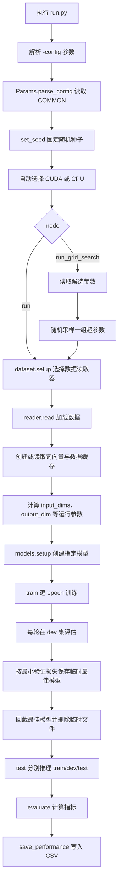

# 多模态情感分析（Multimodal Sentiment Analysis）

本项目基于 PyTorch，对文本（textual）、视觉（visual）和声学（acoustic）三种模态进行融合建模，支持在 CMU-MOSI、CMU-MOSEI 和 IEMOCAP 数据集上进行训练与评估。

项目包含传统融合网络、循环神经网络、多模态 Transformer，以及量子启发式网络和多种注意力/消融变体。贡献者：Feng Xianjie。

## 目录

- [项目结构](#项目结构)
- [环境准备](#环境准备)
- [数据准备](#数据准备)
- [配置文件](#配置文件)
- [快速开始](#快速开始)
- [程序完整运行顺序](#程序完整运行顺序)
- [支持的数据集与模型](#支持的数据集与模型)
- [输出与评估指标](#输出与评估指标)
- [网格搜索](#网格搜索)
- [注意事项](#注意事项)

## 项目结构

```text
.
├── run.py                  # 训练、验证、测试和网格搜索的主入口
├── test.py                 # 数据标签分布统计脚本，不是单元测试入口
├── requirements.txt        # 原始实验环境依赖
├── dataset/                # MOSI、MOSEI、IEMOCAP 数据读取器
├── models/                 # 多模态模型定义及模型工厂
├── layers/                 # 实数、复数和量子启发式网络层
├── optimizer/              # 幺正参数优化器
├── preprocessor/           # 词典和词向量预处理
├── utils/                  # 参数、训练、评估和通用工具
├── read_dataset/           # 数据检查辅助脚本
├── config/                 # 运行配置（被 .gitignore 忽略，需自行创建）
├── tmp/                    # 临时最佳模型和预处理缓存（需自行创建）
└── eval/                   # 评估 CSV（需自行创建）
```

## 环境准备

原始依赖版本较旧，建议使用 Python 3.6 和独立虚拟环境，以减少 `torch==1.8.1+cu101`、`numpy==1.19.5`、`pandas==1.1.5` 等旧版本依赖的兼容问题。

```bash
conda create -n multimodal-sa python=3.6 -y
conda activate multimodal-sa
pip install -r requirements.txt
```

`requirements.txt` 中的 PyTorch 是 CUDA 10.1 版本。如果安装失败，需根据本机 CUDA/CPU 环境单独安装兼容的 PyTorch，再安装其余依赖。程序会自动检测 CUDA：有可用 GPU 时使用 GPU，否则使用 CPU。

## 数据准备

原始预处理数据下载地址：

- [CMU-MOSI、CMU-MOSEI、IEMOCAP 数据集（Dropbox）](https://www.dropbox.com/s/7z56hf9szw4f8m8/cmumosi_cmumosei_iemocap.zip?dl=0)

压缩包包含 CMU-SDK 版本和 Multimodal-Transformer 版本，两者的输入特征维度不同。应选择与目标模型匹配的一套数据，不要把两套特征文件混在同一目录。

数据读取器要求 `pickle_dir_path` 指向的目录中至少包含目标数据集的主文件：

```text
<pickle_dir_path>/
├── cmumosi_data.pkl        # 使用 CMU-MOSI 时
├── cmumosei_data.pkl       # 使用 CMU-MOSEI 时
└── iemocap_data.pkl        # 使用 IEMOCAP 时
```

首次读取后，程序会在同一目录生成或复用以下缓存：

```text
<dataset>_embedding.pkl
<dataset>_train.pkl
<dataset>_valid.pkl
<dataset>_test.pkl
```

如果数据包没有提供 `<dataset>_embedding.pkl`，还需要下载文本格式或 Word2Vec 二进制格式的预训练英文词向量，并通过 `wordvec_path` 指定文件位置。文本词向量会按当前数据集词表抽取子集。

## 配置文件

`config/` 被项目的 `.gitignore` 排除，因此当前源码不附带 `config/run.ini`。运行前需要创建 `config`、`tmp` 和 `eval` 目录，并自行准备配置。

Linux/macOS：

```bash
mkdir -p config tmp eval
```

PowerShell：

```powershell
New-Item -ItemType Directory -Force config, tmp, eval
```

下面是可用于理解配置结构的 CMU-MOSI + MLP 示例。请根据实际数据和词向量位置修改路径：

```ini
[COMMON]
mode = run
dataset_name = cmumosi
pickle_dir_path = data/cmusdk
wordvec_path = glove/glove.6B.300d.txt

features = textual,visual,acoustic
label = sentiment
network_type = mlp

seed = 1234
batch_size = 32
epochs = 20
lr = 0.001
clip = 1.0

hidden_dim_1 = 128
hidden_dim_2 = 64
dropout_rate_1 = 0.2

# 当前 run.py 未调用永久模型保存逻辑，但 save_performance 会读取该字段。
dir_name = not_saved
output_file = eval/cmumosi_mlp.csv
```

所有配置项必须放在 `[COMMON]` 节中。模型超参数并不通用；切换 `network_type` 时，应按照对应的 `models/<模型文件>.py` 构造函数补充参数。

常用公共参数：

| 参数 | 含义 | 常见取值 |
| --- | --- | --- |
| `mode` | 运行模式 | `run`、`run_grid_search` |
| `dataset_name` | 数据集 | `cmumosi`、`cmumosei`、`iemocap` |
| `pickle_dir_path` | 预处理数据目录 | 本地路径 |
| `wordvec_path` | 预训练词向量路径 | 文本文件或 `.bin` 文件 |
| `features` | 使用的模态 | `textual,visual,acoustic` |
| `label` | 任务标签 | MOSI/MOSEI 使用 `sentiment`；IEMOCAP 通常使用 `emotion` |
| `network_type` | 模型标识 | 见下方模型表 |
| `batch_size` | 批大小 | 正整数 |
| `epochs` | 训练轮数 | 正整数 |
| `lr` | RMSprop 学习率 | 如 `0.001` |
| `clip` | 梯度裁剪阈值 | 如 `1.0` |
| `seed` | 随机种子 | 整数 |
| `output_file` | 指标 CSV 路径 | 如 `eval/result.csv` |

## 快速开始

在包含 `run.py` 的项目根目录执行：

```bash
python run.py -config config/run.ini
```

如果省略 `-config`，程序默认读取 `config/run.ini`：

```bash
python run.py
```

推荐的实际操作顺序如下：

1. 创建并激活 Python 3.6 虚拟环境。
2. 安装 `requirements.txt` 中的依赖。
3. 下载并解压目标数据集。
4. 准备预训练词向量，或确认数据目录已有 `<dataset>_embedding.pkl`。
5. 创建 `config/`、`tmp/`、`eval/` 目录。
6. 编写 `config/run.ini`，确认数据集、模态、模型和路径配置。
7. 从项目根目录执行 `python run.py -config config/run.ini`。
8. 查看终端中的验证/测试指标，并在 `output_file` 指定位置查看 CSV。

## 程序完整运行顺序

主程序的实际调用链如下：



对应到源码的详细顺序：

1. `run.py` 使用 `argparse` 获取配置文件路径。
2. `utils.params.Params.parse_config()` 读取 `[COMMON]`，并将布尔值、整数和浮点数转换为对应类型。
3. `utils.generic.set_seed()` 固定 Python、NumPy 和 PyTorch 随机种子。
4. 根据 `torch.cuda.is_available()` 设置 `params.device`。
5. `dataset.setup()` 根据 `dataset_name` 创建 `CMUMOSIReader`、`CMUMOSEIReader` 或 `IEMOCAPReader`。
6. `reader.read()` 读取 `<dataset>_data.pkl`；如无缓存，则建立词典、抽取词向量，并生成 train/valid/test 张量缓存。
7. 数据读取器把 `input_dims`、`output_dim`、`max_seq_len`、`lookup_table` 和训练样本数回写到 `params`。
8. `models.setup()` 根据 `network_type` 实例化模型并移动到选定设备。
9. `utils.model.train()` 使用 RMSprop 训练；存在幺正参数时额外使用 `RMSprop_Unitary`。每轮结束后在开发集计算损失和指标，并保存验证损失最低的临时模型。
10. `run()` 载入最佳临时模型，然后删除该临时文件。
11. `utils.model.test()` 对训练集、开发集和测试集推理，并调用 `utils.evaluation.evaluate()`；最终返回测试集指标。
12. `utils.model.save_performance()` 将数据集、模态、模型名称和评估指标写入 CSV。

## 支持的数据集与模型

支持的数据集：

| `dataset_name` | 数据集 | 默认任务 |
| --- | --- | --- |
| `cmumosi` | CMU-MOSI | 情感回归/分类指标 |
| `cmumosei` | CMU-MOSEI | 情感回归/分类指标 |
| `iemocap` | IEMOCAP | 多类别情绪识别 |

`models.setup()` 当前注册的模型标识：

| 类型 | `network_type` |
| --- | --- |
| 基础模型 | `mlp`、`ef-lstm`、`lf-lstm`、`tfn`、`lmf` |
| 记忆/循环模型 | `mfn`、`graph-mfn`、`marn`、`rmfn`、`lsthm` |
| Transformer/融合模型 | `multimodal-transformer`、`cfn`、`raven`、`almt`、`m3sa`、`megakans` |
| 量子启发式模型 | `qdnn`、`qdnn-ablation`、`qdnnattention`、`quantum-multimodal-transformer`、`local_mixture` |
| 注意力与消融变体 | `local_mixture_attention`、`local_mixture_attention_T`、`local_mixture_attention_A`、`local_mixture_attention_V`、`local_mixture_attention_TV`、`local_mixture_attention_TA`、`local_mixture_attention_VA` |

## 输出与评估指标

对于 `sentiment` 任务，评估结果包括：

- `acc`：按正负极性划分的二分类准确率；
- `binary_f1`：二分类加权 F1；
- `balanced_accuracy`：负类召回率与正类召回率的平均值；
- `macro_f1`：正、负两类 F1 的非加权平均值；
- `majority_baseline_*`：训练集多数类分类器在同一测试样本上的准确率、balanced accuracy 和 macro-F1；
- `accuracy_5`：裁剪到 `[-2, 2]` 后的五分类准确率；
- `accuracy_7`：七分类准确率；
- `MAE`：平均绝对误差；
- `r`：预测值与真实值的 Pearson 相关系数。

为检验准确率不受类别不平衡的误导，矩阵实验会同时保存
`*.predictions.npz`。完成五个种子后，统一脚本使用
`scripts/report_class_imbalance_robustness.py` 对相同测试样本生成三个数据集的
Section 4.3 表格，包含模型、训练集多数类和均匀随机基线。CMU-MOSEI 与 CMU-MOSI
采用情感分数 `>= 0` 的二分类；IEMOCAP 对四个情绪标签分别计算后宏平均。报告输出每次
评估指标、均值±标准差、Markdown 表格和可审计元数据；多数类始终由训练集标签确定。

Linux 服务器使用一个 Bash 入口完成 Section 4.3 的全部实验。默认会补跑 30 个
匹配模型/数据集组合，然后生成三个数据集的类别不平衡基线表、配对统计比较表和填充真实
数值的正文及回复审稿人文本。默认使用 GPU 0 和 GPU 1 并行执行不同随机种子，且每张卡同时运行两个任务；
可通过 `--gpus` 和 `--tasks-per-gpu` 修改 GPU 列表和每卡并发数：

```bash
bash scripts/run_section_4_3_experiments_linux.sh \
  --gpus 0,1 --tasks-per-gpu 2 --conda-env multimodal-sa --table-label S4
```

如已保存五个匹配种子的预测文件，可跳过训练，仅重新生成报告：

```bash
bash scripts/run_section_4_3_experiments_linux.sh \
  --analyze-only --conda-env multimodal-sa --table-label S4
```

该脚本默认使用 `CMU-MOSEI=ALMT`、`CMU-MOSI=MEGAKANs`、`IEMOCAP=EF-LSTM` 作为
预先指定的比较对象。运行前请根据已确定的主指标和复现结果核对这一映射，必要时通过
`--comparators cmumosei=model,cmumosi=model,iemocap=model` 显式替换。统计输出包含
配对逐种子结果、95% CI、置换检验 p 值、全表 Holm 校正、配对 Cohen's \(d_z\)，以及由
真实结果填充的 Section 4.3 与回复审稿人文本。

对于 `emotion` 任务，评估结果包括整体准确率，以及每个情绪类别的准确率和加权 F1。

训练期间的最佳模型只临时保存在 `tmp/`，测试前会被重新载入，随后删除。当前 `run.py` 中永久保存模型的 `save_model()` 调用已被注释，因此默认只保留 CSV 指标，不保留训练好的模型权重。

## 网格搜索

将配置中的运行模式改为：

```ini
mode = run_grid_search
search_times = 20
grid_parameters_file = mlp.ini
output_file = eval/grid_search_cmumosi_mlp.csv
```

候选参数文件应放在 `config/grid_parameters/` 下，每个参数的候选值使用分号分隔：

```ini
[COMMON]
lr = 0.0001; 0.0005; 0.001
batch_size = 16; 32; 64
dropout_rate_1 = 0.1; 0.2; 0.3
```

程序会重复 `search_times` 次：随机抽取一组候选参数，重新读取数据、训练、测试，并持续覆盖更新 `output_file` 中的汇总结果。

## 注意事项

- 必须从包含 `run.py` 的目录启动程序，因为配置、缓存和评估路径均按当前工作目录解析。
- `config/`、`tmp/`、`eval/` 和数据目录被 `.gitignore` 忽略，克隆源码后不会自动出现。
- 训练和推理代码会跳过不足一个完整 `batch_size` 的最后一批数据；若数据量小于 `batch_size`，可能因没有可拼接的预测结果而报错。
- `requirements.txt` 是旧实验环境的完整导出，包含 Jupyter 和部分非核心包；在新版本 Python 中直接安装可能出现兼容问题。
- 代码使用 `DataFrame.append()`，因此应保持 `pandas==1.1.5` 等旧版依赖，或先迁移相关代码再升级环境。
- `test.py` 主要统计标签分布，并不会替代 `run.py` 的正式测试阶段。
- 当前评估输出中的混淆矩阵逻辑针对情感分数编写；使用 IEMOCAP 前建议单独核对该部分是否符合目标情绪标签格式。

## 研究内容

项目围绕量子启发式多模态融合网络展开，并包含数据稀疏性实验、消融实验及超参数实验所需的多种网络变体。具体可复现实验取决于对应的数据版本和模型配置文件。
